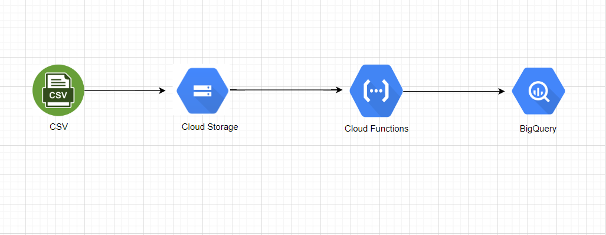
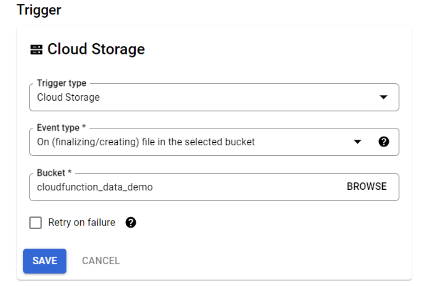

# Cloud Functions

Cloud Storage is set to trigger with Cloud Functions.

Cloud Functions is triggered when a CSV file is uploaded to Bucket. Then it writes the metadata of the data and the data in the CSV file to BigQuery tables. Separate tables were created for metadata and CSV.
