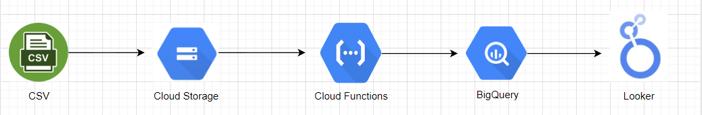
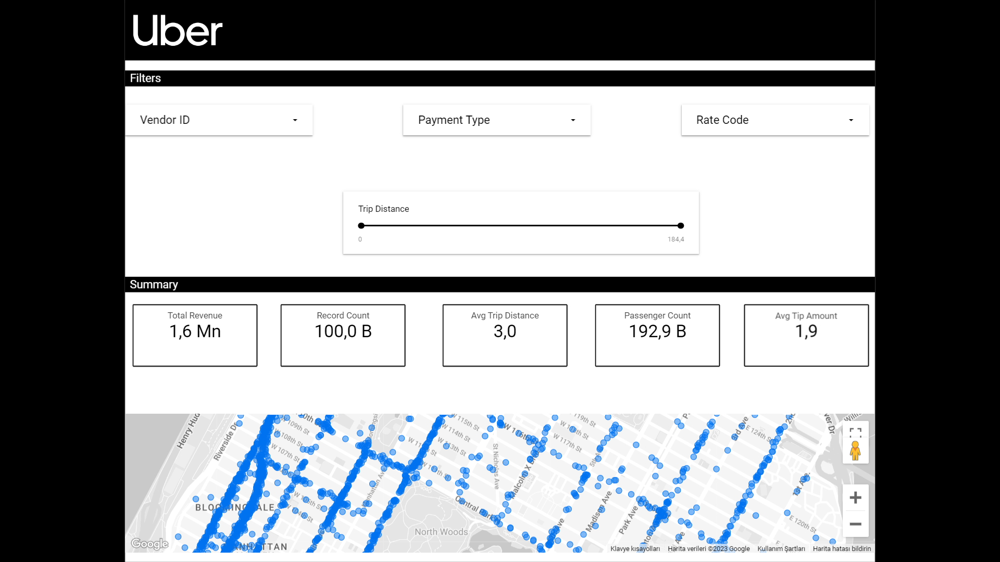
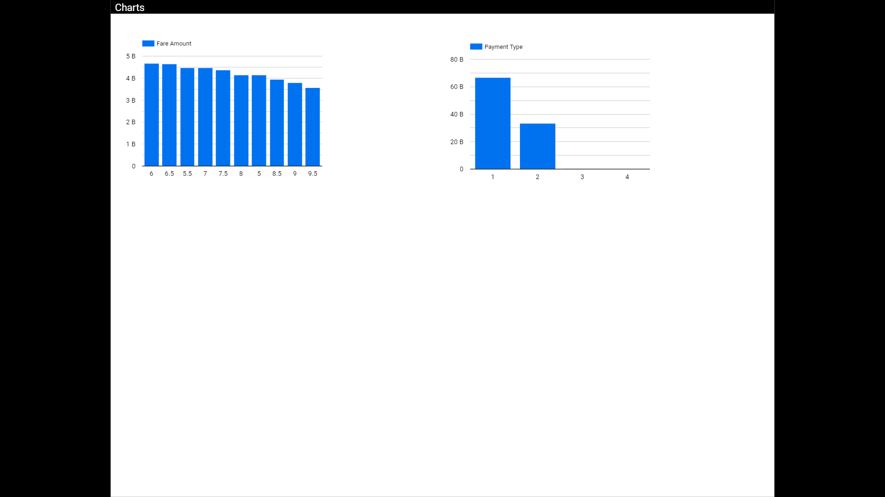

# Cloud Functions

Cloud Storage is set to trigger with Cloud Functions.

'cloud_functions_run.py' script has been written and deployed on Google Cloud. Cloud Functions is triggered when a CSV file is uploaded to Bucket. Then it writes the metadata of the data and the data in the CSV file to BigQuery tables. Separate tables were created for metadata and CSV.

<h1>Dashboard</h1>

A dashboard was prepared with Looker Studio. The data was visualized and analyzed. Latitude and longitude data for the map section were created using the CONCAT function. CONCAT(pickup_latitude, ",", pickup_longitude). Each point on the map represents a location.
